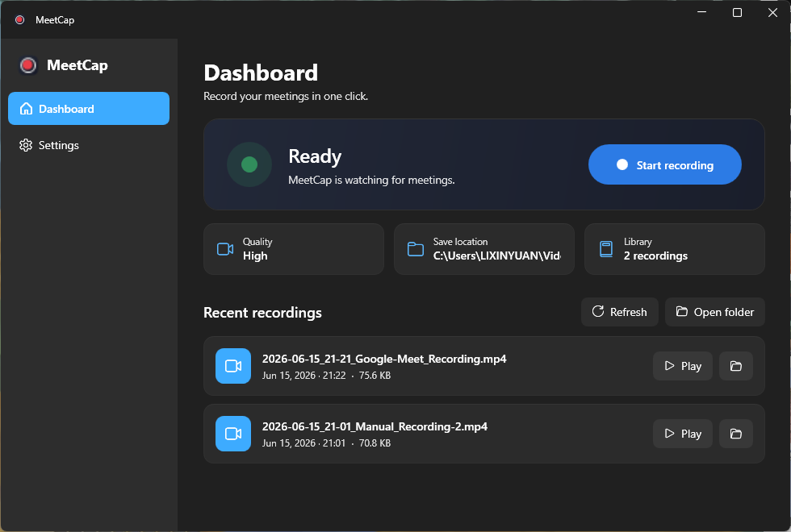

# MeetCap

A simple, reliable meeting recorder for Windows. MeetCap watches for online meetings,
asks if you want to record, and saves a clean MP4 of your screen plus system and microphone
audio — with a clear on-screen indicator the whole time. It lives quietly in the system tray
and starts with Windows.



---

## Highlights

- **Modern Windows 11 UI** — WPF + [WPF-UI](https://github.com/lepoco/wpfui) Fluent styling, dark theme, Mica backdrop.
- **Runs in the background** — minimizes to the tray instead of closing; optional start-on-sign-in.
- **Meeting detection** — Zoom & Teams desktop clients, plus Google Meet / Zoom Web / Teams Web in browsers.
- **Consent-first** — nothing is ever recorded without your action; a floating red indicator shows when recording is live.
- **High-quality capture** — `Windows.Graphics.Capture` + Media Foundation hardware H.264 (NVENC/QuickSync/AMF) into a single corruption-resistant MP4.
- **Zero-dependency install** — ships self-contained, so end users don't need to install .NET.

---

## How detection works (safe signals only)

MeetCap polls a few **local, read-only** signals every ~3 seconds — nothing is sent anywhere:

| Signal | Used for |
| --- | --- |
| **Per-process audio sessions** (Windows Core Audio) | The primary "in a call" signal — attributed to the *specific* app, and active even when you're muted (you still hear the call) |
| **UI Automation** (accessibility tree) | Authoritative confirmation for Teams/Zoom desktop — finds the in-call "Leave"/"Hang up" control; also catches a muted + deafened + camera-off call |
| Visible window / browser-tab titles | Platform attribution (`"Zoom Meeting"`, `"Google Meet"`, …) |
| Running processes | Which apps are candidates |
| Webcam in-use (Capability Access Manager registry) | Extra corroboration |

Detection is **layered by confidence**: a UI-Automation hit or Zoom's dedicated meeting window is
treated as definitive; otherwise a per-process audio session on the matching app (browsers also need
a matching tab title) triggers it. Start is confirmed over two polls (so a one-off notification sound
can't trigger a prompt) and end is debounced over several polls (so a brief flicker won't stop a
recording).

There is **no screen scraping, no code injection, and no network access** in the detection path —
UI Automation is the same read-only accessibility API that screen readers use.

> **On "100% accuracy":** the desktop path (UI Automation + audio) is about as reliable as a
> non-invasive method gets. The honest residual limits: UI-Automation control names are localized
> (tune `LeaveHints` in [UiAutomationDetector.cs](src/MeetCap/Services/UiAutomationDetector.cs) for
> other languages), and browser meetings still rely on audio + tab title. A literal 100% for web
> meetings would require a companion browser extension reading the page's real call state.

---

## Architecture

A normal interactive **user-session** app (deliberately *not* a Windows Service — screen and audio
capture only work in the interactive session, never in Session 0).

```
src/MeetCap/
  App.xaml(.cs)              Composition root: DI, single-instance, tray icon, lifecycle
  Models/                    AppSettings, RecordingQuality, MeetingPlatform, RecordingItem
  Interop/
    WindowEnumerator.cs      EnumWindows -> visible window titles + owning process (read-only)
    ProcessAudioMonitor.cs   Per-process active audio sessions (Core Audio) — primary call signal
    MediaUsageMonitor.cs     Mic/cam "in use" via ConsentStore registry (corroborator)
    NativeScreen.cs          Primary-display pixel size (GetSystemMetrics)
  Services/
    SettingsService.cs       JSON settings in %APPDATA%\MeetCap
    AutoStartService.cs      Start-on-sign-in via HKCU\...\Run (easy to toggle)
    UiAutomationDetector.cs  Reads Teams/Zoom in-call controls via UI Automation (FlaUI)
    MeetingDetectionService  Polls signals; raises MeetingStarted / MeetingEnded
    RecordingService.cs      ScreenRecorderLib wrapper (screen + system + mic -> MP4)
    RecordingLibraryService  Lists recent recordings; open/reveal in Explorer
    NotificationCoordinator  Detected -> ask/auto-record -> indicator -> ended -> ask to stop
  ViewModels/                MVVM (CommunityToolkit.Mvvm): Main / Dashboard / Settings
  Views/                     MainWindow (FluentWindow), Dashboard/Settings pages,
                             MeetingPromptWindow (toast), RecordingIndicatorWindow
```

### Stack
- **.NET 8** (LTS), **WPF**, **WPF-UI** (Fluent look)
- **CommunityToolkit.Mvvm** for MVVM
- **ScreenRecorderLib** for capture + encoding
- **NAudio** for per-process audio-session detection
- **FlaUI** (UI Automation) for desktop in-call confirmation
- **Hardcodet.NotifyIcon.Wpf** for the tray icon
- **Inno Setup** for the install wizard

---

## Build & run (developers)

> Requires the **.NET SDK** and builds for **x64** (ScreenRecorderLib is x64-only).

```powershell
# Build
dotnet build MeetCap.sln -c Debug

# Run
dotnet run --project src/MeetCap/MeetCap.csproj
```

The `.sln` is configured for `x64`. If you build the `.csproj` directly with the bare
`dotnet build`, pass `-p:Platform=x64`.

## Package (self-contained)

```powershell
powershell -File build/publish.ps1
# -> artifacts/publish  (app + .NET runtime + native capture DLLs)
```

## Build the installer

```powershell
winget install JRSoftware.InnoSetup     # one-time
powershell -File build/make-installer.ps1
# -> artifacts/installer/MeetCap-Setup-1.0.0.exe
```

The installer drops a Start Menu (and optional desktop) shortcut, offers to launch MeetCap
minimized to the tray, and cleans up its start-on-sign-in entry on uninstall. Your recordings
in `Videos\MeetCap` are never touched.

### Zero-install for end users

The published app is fully self-sufficient — users do **not** install anything:

- **.NET 8 runtime** — bundled inside the self-contained publish.
- **Windows system DLLs** (Media Foundation, Direct3D, UCRT) — already part of Windows 10/11.
- **Visual C++ runtime** (`MSVCP140` / `VCRUNTIME140` / `CONCRT140`, required by ScreenRecorderLib's
  C++/CLI core) — shipped **app-local** by `build/publish.ps1`, copied next to the exe where they take
  load priority. No VC++ redistributable install and no admin step needed.

> The app-local VC++ DLLs are copied from the build machine's `System32`. Build on an up-to-date
> Windows with the VC++ 2015–2022 x64 runtime present (any dev machine with Visual Studio has it).

---

## Recordings

- Default folder: `Videos\MeetCap` (changeable in Settings).
- File names: `2026-06-15_14-30_Google-Meet_Recording.mp4`
- Quality tiers:
  - **Standard** — 1080p, 30 fps, smaller files
  - **High** — native resolution, 30 fps
  - **Ultra** — native resolution, 60 fps, best quality
- Fragmented + fast-start MP4 keeps files playable even if the session is interrupted.

---

## Privacy

MeetCap is consent-first. Detection uses only local signals, recording always starts from your
explicit choice (or a per-platform "record automatically" you set yourself), and a visible
indicator stays on screen while recording. Always make sure other participants are aware that a
meeting is being recorded, as required by the laws in your area.
